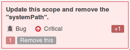

# com.sun.tools.attach

## About 

### What

Maven repackaging of OpenJDK's `com.sun.tools.attach` and `com.sun.tools.attach.spi` packages.

### Why

When you include the JDK's tools.jar in your Maven POM:

		<dependency>
			<groupId>com.sun</groupId>
			<artifactId>tools</artifactId>
			<version>${version.java}</version>
			<scope>system</scope>
			<systemPath>${java.home}/../lib/tools.jar</systemPath>
		</dependency>

[SonarQube](https://www.sonarqube.org/) 6.4 will display (Squid [S3422](https://sonarcloud.io/organizations/default/rules#rule_key=squid%3AS3422)):

Instead you may replace with:

		<dependency>
			<groupId>io.earcam.wrapped</groupId>
			<artifactId>com.sun.tools.attach</artifactId>
			<version>1.8.0_jdk8u131-b11</version>
			<scope>test</scope>
		</dependency>

If you need to depend on the API itself then use `<scope>provided</scope>` and `<optional>true</optional>`, it will still run happily in surefire tests but shouldn't be pulled to any distribution assembly.

### Miscellaneous

Maven is correct to require a dependency as `com.sun.tools.attach` is not part of the JRE.  SonarQube is also correct to freakout at the sight of `systemPath`.

Since Java 8 (in preparation for modularity in Java 9), there has existed an annotation [@jdk.Exported](https://docs.oracle.com/javase/8/docs/jdk/api/javac/tree/jdk/Exported.html) used to mark the intentionally public part's of the JDK ([published API](https://martinfowler.com/bliki/PublishedInterface.html)).

Interestingly [forbidden-apis](https://github.com/policeman-tools/forbidden-apis) uses `Security.getProperty("package.access")` for it's **jdk-internal** check.

## Versions

Available versions listed on [Maven Central](http://search.maven.org/#search%7Cga%7C1%7Cg%3A%22io.earcam.wrapped%22%20AND%20a%3A%22com.sun.tools.attach%22).

The modularity that comes with Java 9, means that the attach API will be available in **jdk.attach.jmod** - therefore it is unlikely this library will be maintained (at least in current form).  

## Status

## JVMs

### Supported 

### Unsupported

The IBM JDK does not use the OpenJDK core for `com.sun.tools.attach` and the necessary implementation classes are not open source.
 
I did view the required class files (`javap`, I swear I didn't decompile them 😉) and also check the licence terms for rev-eng and redistribution, while IANAL, it clearly would breach the IBM licence ([for Non-Warranted Programs (Z125-5589-05)](https://www-03.ibm.com/software/sla/sladb.nsf/pdf/ilan/$file/ilan_en.pdf).

## Licences

